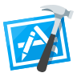

<h3>Hey,&nbsp;</h3>

I am a Software Engineer, Expert in Frontend development. Continuous working on Scalable, Dynamic, Fully Responsive (Mobile Friendly) Web💻 & Mobile applications📱)

🎉 Also have good experience in MERN Stack Development

- 🔭 I’m currently contributing in [WebHR (Cloud Base HR Product)](https://web.hr/) and [HireSide (Gig Economy Based Product)](https://hireside.com/)

- 🖥 I’m currently learning **Typescript, Amazon Web Services (AWS), Web 3.0 Blockchain development**

- 💬 Ask me about **React, React-Native, Next.js, Gatsby.js, Javascript, React-Stack, Redux, Redux-Toolkit, Context-API, High-Charts, React-Bootstrap, React-JSS, Tailwind, Material-UI**

- 📫 How to reach me **m.mudassirkz@gmail.com**

 
               

<i><b>Currently Working and Learning:</b></i> 
    
   &nbsp;
  &nbsp;
  &nbsp;
  &nbsp;
    &nbsp;
  &nbsp;
  &nbsp;

<i><b>Tools known:</b></i> 
    
   &nbsp;
  &nbsp;
  &nbsp;
 &nbsp;
  &nbsp;
  &nbsp;

<i><b>Profiles:</b></i> 
    
<a href="m.mudassirkz@gmail.com">
&nbsp;
</a>
<a href="https://www.linkedin.com/in/muhammad-mudassir-107029237/">
&nbsp;
</a>
  
<a href="https://twitter.com/mudassirkzee">
&nbsp;
</a>

<a href="https://www.instagram.com/mudassir__kz/">
&nbsp;
</a>

